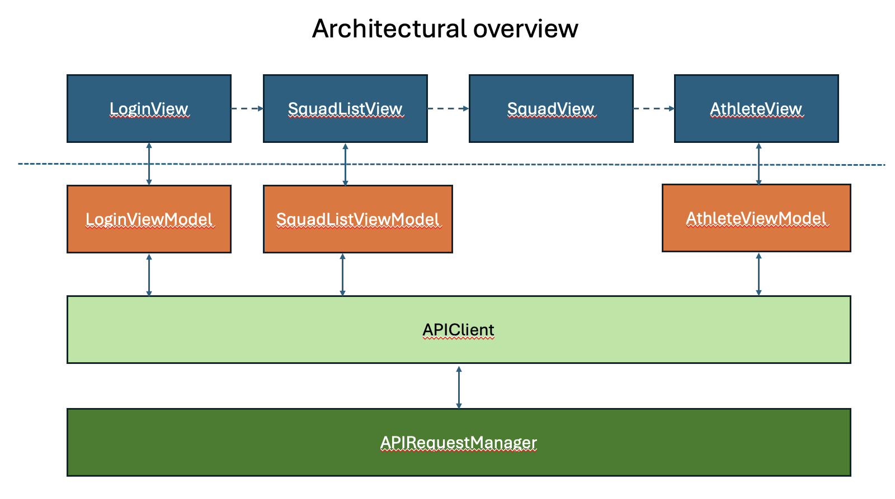

# Kitman Labs Mobile Tech Test API

_A simple API to be use for Kitman Labs mobile team tech tests._

## Implementation


### Features
Implementation uses a clean Architecture where inner / upper layers use services from outer / lower layers:
   - Network layer / APIRequestManager: 
        - single purpose module to provide foundational Rest services
        - conforms to `APIRequestable` for loose coupling and enable testing in `APIClient`
   - Model layer via `APIClient` for Model instantiation:
        - uses Network layer to retrieve Data & instantiates data to respective model
        - takes advantage of POP to inject `APIRequestable` mock object to enable testing
        - single purpose module to abstract API methods to request squads / athlete data
   - Dedicated observable view models on top of model layer to load / propagate change
      - Dedicated View Models for athlete & squads request data on background thread and switch to main thread to update observables
   - Loosely coupled views connected via 'NavigationPath' that allow injection of previously retrieved data
   - Background / data tasks offloaded of Mainthread to unblock UI tasks and scheduled on background threads
   - Global `ImageCache` to add image caching support
      - provided via environment to allow individual views to request images
      - requests image data on background thread to avoid redundancy. 
      - Based on `NSCache` to take advantage of its memory pressure handling 
- Unit tests via SwiftTesting   
   - takes advantage of protocol abstraction of lower layers to mock
- Key Design Patterns: #POP, #Clean architecture, #Dependency Injection, #Single Responsibility Principle

### Shortcuts
Shortcuts have been taken:
- Simplistic UI:
   - to visualise requested objects with an emphasis on the architecture
- No localisation / localised bundle
   - Skipped due to being a tech demo
- No accessibility support:
   - Skipped due to being a tech demo
- No error handling:
   - Skipped due to being a tech demo
   - errors are mapped to nil-optional or handled via empty catch - blocks. No propagation to user i.e. no user feedback
- Theming / Dark mode:
   - Skipped due to being a tech demo
- data models used as view models
   - Skipped due to simplistic data models
   - Models used in view models e.g. `SquadViewModel` contain too many properties. In general changes in models propagate re-rendering of View stack. Although a Swift UI `View` is lightweight this may eventually cause performance issues often visible in glitching animations. Hence, having not-properties e.g. dates may cause a performance impact later on
- ImageCache is not routed through Network layer (`APIRequestManager` / `APIClient`)
  - Skipped due to being a tech demo for simplicity’s sake
- no XCUitests
  -  Skipped due to being a tech demo for simplicity’s sake
- initial set of unit tests for demonstration purposes
  - Unit test code coverage is insufficient.
  - Provided tests only to be considered as an "How-to" approach
- no snapshot tests
- Skipped due to being a tech demo for simplicity sake
- Dynamic Fonts:
   - Supported as part of SwiftUI but not validated.

### Thoughts
- Constrained Login button to require at least 3 characters for password & username. API doesn't seem to return an error
- API methods squads / athletes should require authentication
- API methods squads / athletes should allow for individual Id e.g. /squad/<id> , /athlete/<id>


## Challenge

The base challenge is to create a small app with a basic login along with a view that displays a list of athletes along with an athlete details screen. The UI isn't expected to be beautiful as it's a tech test, not an art piece, but give consideration to UX and general app flow.

The exact end product is up to you, you will have access to athlete's squads so if you find a way to utilise that, even better.

Spend no more than a day working on it, we understand this is your free time and don't want to take up any more than necessary.

Use this as an opportunity to showcase your own engineering values along with what you feel are important aspects of mobile app development. While you possibly won't be able to include everything you wanted, make the most of what you can and tell us what you would've like to of added or expanded given more time. 

You can use what ever libraries you feel necessary.

**Delieverable**

* Ideally a Github/bitbucket link to a repo containing the app. If that's not possible, send over a full runnable zip of the project/workspace.

Base URL:  [https://kml-tech-test.glitch.me](https://kml-tech-test.glitch.me)

### Endpoints

#### Athletes

Returns a list of athletes

* Method:       `GET`
* Path:         `/athletes`
* Content Type: `application/json`
* Params:        None

Sample Response: 
``` 
[
   {
      "first_name":"Adam",
      "last_name":"Beard",
      "id":1964,
      "image":{
         "url":"https://kitman.imgix.net/avatar.jpg"
      },
      "username":"abeardathlete",
      "squad_ids":[
         78
      ]
   },
   {
      "first_name":"Al",
      "last_name":"Saunders",
      "id":5011,
      "image":{
         "url":"https://kitman.imgix.net/avatar.jpg"
      },
      "username":"asaunders",
      "squad_ids":[
         78
      ]
   }
]
```

#### Squads

Returns a list of squads

* Method:       `GET`
* Path:         `/squads`
* Content Type: `application/json`
* Params:        None

Sample Response: 
``` 
[
   {
      "created_at":"2015-09-14T18:26:11.000Z",
      "id":78,
      "name":"staff",
      "organisation_id":6,
      "updated_at":"2015-09-14T18:26:11.000Z"
   },
   {
      "created_at":"2015-09-02T19:42:22.000Z",
      "id":72,
      "name":"Active Roster",
      "organisation_id":6,
      "updated_at":"2015-09-02T19:42:22.000Z"
   }
]
```
#### Session

Dummy login end point, any username and password combination will work once they are three characters or more. Just use to validate your login flow.

* Method:       `POST`
* Path:         `/session`
* Content Type: `application/json`
* Body:        
```
{
    "username": "sampleUsername",
    "password": "samplePassword"
}
```

Sample Response: 
```
{
    "username": "sampleUsername"
}
```
